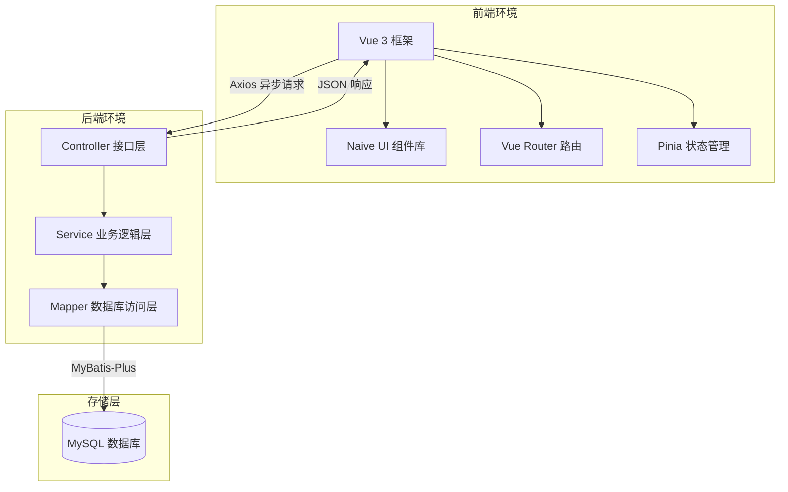

# Java 企业级应用开发课程设计报告

**题目：新闻发布与管理系统的设计与实现**

---

## 1. 绪论

### 1.1 项目背景
在当今互联网高速发展的时代，信息的传播与获取变得尤为快捷。新闻作为获取社会动态和行业信息的重要途径，其时效性与内容的丰富性备受关注。传统的人工维护新闻模式不仅效率低下，且难以满足用户实时交互、多维度分类检索和全方位评论监管的需求。因此，开发一个稳定、高效的新闻发布与管理系统，对于提高内容管理效率和增强用户体验具有重要的实际应用价值。

### 1.2 开发环境与技术栈

#### 1.2.1 软件开发环境
* **集成开发环境**：IntelliJ IDEA
* **前端开发工具**：Vite
* **Java 开发工具包**：JDK 17
* **前端运行环境**：Node.js
* **数据库服务**：MySQL 8.0
* **版本控制工具**：Git

#### 1.2.2 系统技术栈
本系统采用前后端分离架构，实现高内聚低耦合的设计：
* **后端技术栈**：
  * **主框架**：Spring Boot
  * **持久层框架**：MyBatis-Plus
  * **数据源管理**：MySQL
  * **参数校验**：Spring Validation
  * **安全认证**：JWT
  * **密码学算法**：BCrypt
  * **跨域解决**：自定义跨域过滤器与 Web MVC 配置
* **前端技术栈**：
  * **主框架**：Vue 3
  * **页面构建**：Vite
  * **用户界面组件库**：Naive UI
  * **异步请求库**：Axios
  * **前端路由管理**：Vue Router
  * **状态管理**：Pinia
  * **富文本渲染**：md-editor-v3

---

## 2. 系统需求分析

### 2.1 角色与权限分析
本系统根据业务需求，设计了两种不同的用户角色：
1. **游客与普通用户**：
   * 游客可以浏览已发布的新闻列表、按分类进行筛选、使用关键字搜索新闻，以及查看新闻详情和评论。
   * 普通用户在登录后，除了拥有游客的所有权限外，还可以发表评论、删除自己发表的评论，以及在个人中心修改个人基本信息。
2. **系统管理员**：
   * 拥有后台管理系统的全部权限。
   * 具备后台首页统计看板查看、用户管理、新闻分类管理、新闻内容管理和评论监督管理能力。
   * 负责新闻封面的上传以及 Markdown 格式新闻的发布与状态控制。

### 2.2 功能需求规格
系统共划分出八个功能模块，各模块的职责如下：
* **认证管理模块**：提供用户注册、通用登录、Token 鉴权以及退出登录功能。
* **前台新闻模块**：提供新闻列表分页加载、新闻分类筛选、标题模糊搜索、新闻详情展示和浏览量自增。
* **评论交互模块**：提供新闻详情页评论加载、登录用户发表评论（限制纯文本，500字以内）、删除个人历史评论，以及后台隐藏/删除评论。
* **用户管理模块**：提供用户列表查询、新增后台/前台用户、用户属性修改、账户禁用与启用、密码强制重置。
* **新闻分类模块**：提供分类的创建、更新、逻辑删除（若分类下有新闻则拒绝删除）、状态更改（启用或禁用）和优先级排序。
* **新闻管理模块**：提供新闻的草稿保存、正式发布、下架管理、内容二次编辑和逻辑删除。新闻正文支持 Markdown 语法。
* **文件上传模块**：提供新闻封面图片上传，限制图片格式为 JPG、JPEG、PNG，大小限制在 2MB 以内。
* **数据统计模块**：为管理员提供仪表盘，包含用户总数、新闻总数、分类总数、评论总数以及不同状态新闻的分布数量。

### 2.3 非功能需求分析
* **安全性**：用户密码必须通过 BCrypt 进行加盐哈希加密存储；敏感接口必须通过自定义拦截器实施 JWT 签名验证；后台管理接口需拦截并校验用户角色属性。
* **性能效率**：列表查询强制使用分页；新闻列表页仅返回摘要等简要信息，只有进入详情页才传输完整的 Markdown 正文；常用检索字段建立索引。
* **易用性**：前端使用 Naive UI 保证界面清爽美观；交互操作（如删除）提供二次确认弹窗；表单录入提供前端与后端的双重校验提示。
* **可维护性**：后端遵循 Controller、Service、Mapper 的三层架构，统一使用接口返回对象和全局异常拦截；前端代码采用模块化组织，不使用大型繁琐模板。

---

## 3. 系统总体设计

### 3.1 总体架构设计
系统采用典型的前后端分离应用架构。前端项目在浏览器中运行，通过 Axios 库向后端发送异步请求。后端基于 Spring Boot 框架接收请求，解析业务逻辑，并通过 MyBatis-Plus 操作 MySQL 数据库进行持久化。



### 3.2 数据库设计

#### 3.2.1 实体关系模型说明
系统包含四个核心实体：用户、新闻分类、新闻、评论。
* 一个用户可以发布多篇新闻（一对多关系）。
* 一个用户可以发表多条评论（一对多关系）。
* 一个新闻分类可以对应多篇新闻（一对多关系）。
* 一篇新闻可以拥有多条评论（一对多关系）。

#### 3.2.2 数据库表结构


---

## 4. 系统详细设计与实现

### 4.1 安全认证与拦截机制
后端开发中，通过配置自定义拦截器来对非公开接口进行拦截，通过在请求头中提取 Token 并调用 JWT 工具类进行解析，从而将登录用户的个人信息绑定至当前请求线程上下文中，便于后续业务层直接读取。

密码安全上，用户注册和修改密码时，均通过加密算法对明文密码进行处理，随后再将生成的密文写入数据库，确保即使数据库泄露也无法还原用户原始密码。

### 4.2 核心业务层设计实现
后端业务分层规范，各模块通过映射类操作数据库，利用逻辑删除机制标记被删除的行。以下为关键模块的设计细节：

* **文件上传及映射**：
  为避免大量图片数据占用数据库空间，系统将图片文件物理保存在服务器宿主机目录，将生成的相对文件名写入对应表。为了能够在前端正常渲染，通过实现配置类将磁盘物理路径映射为静态资源访问地址。
* **分级评论机制**：
  前台加载新闻时，将拉取对应新闻下所有状态为显示且逻辑删除标记为正常的评论记录。由于删减操作需要验证操作者身份，删除接口被拦截器保护，普通用户仅能注销自身发布的评论，而管理员可以对任意不合规评论进行隐藏或删除。

### 4.3 前端页面组件与布局设计
前端采用轻量自定义开发，为前台和后台配置了不同的视图布局：
* **前台布局**：包括顶部的自适应导航栏、中部的内容展示卡片以及页脚的版权声明。新闻正文展示引入 Markdown 渲染组件，配合样式表实现段落排版。
* **后台布局**：左侧为多级树形导航菜单，支持展开和收起；顶部为面包屑导航及管理员信息展示，支持一键登出；右侧内容区域为带滚动条的单页面应用视图。

---

## 5. 系统运行与界面展示

### 5.1 用户登录与注册页面
前台普通用户可通过注册页面完成账户初始化。登录界面作为统一入口，用户输入账号和密码后，系统经过格式检验送往后端处理，成功后分流跳转。

```
+---------------------------------------------------------+
|                                                         |
|                     [ 登录 / 注册 ]                     |
|                                                         |
|   用户名: [ 占位输入框 ]                                |
|   密  码: [ 占位输入框 ]                                |
|                                                         |
|       ( 登录 )       ( 去注册 )                         |
|                                                         |
+---------------------------------------------------------+
[截图占位符：用户登录与注册界面]
```

### 5.2 前台新闻浏览列表
前台首页展示所有处于发布状态的新闻列表。用户可在顶部根据分类选项卡进行点击过滤，或在搜索栏中输入关键字完成匹配检索。

```
+---------------------------------------------------------+
|  [ MoeNews 导航栏 ]               ( 搜索框 )  [ 登录 ]  |
+---------------------------------------------------------+
|  [ 分类1 ]  [ 分类2 ]  [ 分类3 ]                        |
+---------------------------------------------------------+
|  +--------------------+   +--------------------+        |
|  | 新闻标题A           |   | 新闻标题B           |        |
|  | [封面图片占位]      |   | [封面图片占位]      |        |
|  | 新闻摘要...         |   | 新闻摘要...         |        |
|  | ( 2026-06-27 )      |   | ( 2026-06-27 )      |        |
|  +--------------------+   +--------------------+        |
+---------------------------------------------------------+
[截图占位符：前台新闻列表与筛选检索界面]
```

### 5.3 新闻详情与评论发表
用户点击列表中任意新闻卡片后跳转至新闻详情页。正文由富文本预览器对 Markdown 进行展示，底部列出历史评论。登录用户可填入内容并发表。

```
+---------------------------------------------------------+
|  [ MoeNews 导航栏 ]                                     |
+---------------------------------------------------------+
|  <h1>新闻标题A</h1>                                      |
|  时间: 2026-06-27 | 浏览量: 100                          |
|  -----------------------------------------------------  |
|  [ Markdown 渲染的新闻正文内容，支持代码高亮与列表 ]    |
|  -----------------------------------------------------  |
|  评论区:                                                |
|  - 张三: 写的很棒！ ( 2026-06-27 )                       |
|  - 李四: 对此表示赞同。 ( 2026-06-27 )                   |
|                                                         |
|  [ 请输入评论内容... ]                                  |
|  ( 发表评论 )                                           |
+---------------------------------------------------------+
[截图占位符：前台新闻详情渲染与评论互动界面]
```

### 5.4 后台管理系统主页
管理员登录后直接进入后台主页。该页面直观展示了仪表盘，包含四个核心实体的统计总数以及新闻状态图表。

```
+---------------------------------------------------------+
| [MoeNews 后台]   欢迎您，系统管理员 admin               |
+---------------------------------------------------------+
| (菜单栏)   |  +---------+ +---------+ +---------+        |
| - 首页     |  | 用户总数| | 新闻总数| | 分类总数|        |
| - 用户管理 |  |   10人  | |   25篇  | |    5个  |        |
| - 新闻管理 |  +---------+ +---------+ +---------+        |
| - 分类管理 |  新闻状态统计:                              |
| - 评论管理 |  已发布 [=== 80% ===]                       |
|            |  草稿   [= 10% =]                           |
|            |  已下架 [= 10% =]                           |
+---------------------------------------------------------+
[截图占位符：后台首页数据统计大屏界面]
```

### 5.5 后台新闻编辑与 Markdown 编辑器
管理员发布或编辑新闻时进入此页。系统集成了 Markdown 预览编辑器，左侧为源码输入区，右侧显示实时渲染排版，支持上传本地图片作为封面。

```
+---------------------------------------------------------+
| [MoeNews 后台] > 发布新闻                               |
+---------------------------------------------------------+
| 标题: [ 占位输入框 ]     分类: [ 下拉选择框 ]            |
| 封面: [ + 上传封面图片 ]                                |
| 摘要: [ 占位输入框 ]                                    |
| +-----------------------------------------------------+ |
| | (编辑区)                        | (预览区)          | |
| | # 标题                          | 标题              | |
| | 正文内容                        | 正文内容          | |
| |                                 |                   | |
| +-----------------------------------------------------+ |
| ( 保存草稿 )       ( 正式发布 )                         |
+---------------------------------------------------------+
[截图占位符：后台新闻编辑与实时 Markdown 预览界面]
```

### 5.6 用户与评论监督管理
管理员在用户管理界面对违规账户进行封禁；在评论管理界面中，可对各种敏感或垃圾评论一键执行“隐藏”操作，使得前台不再进行渲染。

```
+---------------------------------------------------------+
| [MoeNews 后台] > 评论管理                               |
+---------------------------------------------------------+
| 搜索内容: [ 占位框 ]     状态: [ 启用/禁用 ]            |
| +-----------------------------------------------------+ |
| | 用户名 | 评论内容         | 状态 | 操作             | |
| |--------|------------------|------|------------------| |
| | user   | 违规评论内容A    | 显示 | [隐藏] [删除]    | |
| | test   | 正常评论内容B    | 隐藏 | [显示] [删除]    | |
| +-----------------------------------------------------+ |
+---------------------------------------------------------+
[截图占位符：后台评论审查与隐藏删除操作界面]
```

---

## 6. 系统测试

### 6.1 测试环境
* **操作系统**：Windows 11
* **测试浏览器**：Google Chrome 
* **数据库连接状况**：本机 MySQL 8.0 运行正常，共载入 4 个业务表
* **后端服务运行状况**：Spring Boot 服务占用 8080 端口，前端开发服务器占用 5173 端口

### 6.2 测试用例与测试结果

#### 6.2.1 账户验证测试
* **测试用例 1**：注册重名账号。
  * *操作步骤*：点击前台注册，输入已存在的用户名并提交。
  * *预期结果*：系统提示“用户名已存在”，拒绝写入数据库。
  * *实际结果*：符合预期，后端返回状态码 400 及错误消息。
* **测试用例 2**：非管理员角色强行访问后台接口。
  * *操作步骤*：普通用户登录后，尝试通过接口测试工具直接请求后台统计接口。
  * *预期结果*：后端拦截器识破用户角色，返回“无权访问”提示。
  * *实际结果*：符合预期，系统拦截该请求并返回状态码 403。

#### 6.2.2 核心业务流程测试
* **测试用例 3**：管理员发布新分类及关联新闻。
  * *操作步骤*：进入后台管理，新增“科技”分类；接着进入新闻发布页，选择“科技”分类，编辑 Markdown 正文并上传一张封面，点击发布。
  * *预期结果*：分类添加成功；新闻列表和详情保存完整；前台能正常按“科技”筛选并查看图文。
  * *实际结果*：符合预期，数据库生成相应行记录，图片成功写入上传目录且映射正常，前端完美排版。
* **测试用例 4**：普通用户发表并删除评论。
  * *操作步骤*：以普通用户身份进入新闻详情页，提交一条简短评论；之后点击该评论旁边的删除按钮。
  * *预期结果*：评论立即在前台出现；点击删除后评论在当前页面中消失，数据库中标记删除。
  * *实际结果*：符合预期，删除后前台重新渲染列表，数据库记录的物理行依然保留但逻辑删除状态被置为已删除。

---

## 7. 课程设计总结

### 7.1 方案评估与系统优缺点分析
* **优点**：
  * 系统架构分工明确，前后台解耦使得修改前端UI时无需重启后端。
  * 引入了基于逻辑删除的数据物理保护机制，防止误删带来的数据混乱。
  * 编辑新闻集成了轻量级 Markdown 编辑器，极大地降低了富文本保存 and 处理难度。
* **缺点**：
  * 评论机制目前为单向一级结构，尚未支持用户之间相互回复。
  * 图片采用服务器本地磁盘存储，多服务器部署时存在同步问题。
  * 系统无复杂权限体系，尚不支持对多管理员划分子角色。

### 7.2 遇到的问题与解决方案
* **问题 1：静态资源上传后无法及时访问。**
  * *产生原因*：由于图片保存在项目外部的本地磁盘，前端使用相对路径时后端容器找不到该资源。
  * *解决方法*：在后端实现 Web MVC 配置类，将特定的访问前缀映射至服务器本地的绝对路径。
* **问题 2：前后端调用接口发生跨域错误。**
  * *产生原因*：前端开发服务器运行在 5173 端口，后端服务监听在 8080 端口，浏览器同源策略限制了请求。
  * *解决方法*：后端引入跨域配置，通过自定义过滤器或跨域注解在响应头中添加允许的源和方法。

### 7.3 社会、安全、法律及文化影响评价
本系统的建设和开发遵守国家互联网信息服务管理相关规定。在设计中，通过对垃圾评论提供后台隐藏一键干预功能，能够及时拦截各种涉嫌低俗、违法和违规的信息传播，承担了内容平台的社会责任。
在安全层面，采用 JWT 鉴权和 BCrypt 密码加密保护了用户隐私；在设计时保留了拓展接口，未来可通过对接第三方内容安全接口，实现评论的自动化审核，确保信息平台的合规性和绿色健康。

### 7.4 课程设计收获与体会
通过为期一周的课程设计，我深入理解并实践了企业级 Java Web 项目的核心开发流程。不仅掌握了 Spring Boot 和 MyBatis-Plus 的高效协同开发，也加深了对 Vue 3 响应式原理和前端路由权限控制的理解。在开发过程中遇到并解决的一系列关于跨域、多环境路径映射、权限拦截等实际问题，大大提升了自己独立排查错误和设计复杂工程的动手能力，为将来的就业打下了扎实的基础。

---

## 8. 参考文献
* [1] 钟林森，罗剑. Spring Boot 企业级项目开发——入门到精通[M]. 武汉: 华中科技大学出版社, 2020.
* [2] 肖睿. Vue 企业开发实战[M]. 清华大学出版社, 2018.
* [3] 李刚. 轻量级 Java Web 企业应用实战——Spring MVC Spring MyBatis 整合开发[M]. 北京: 电子工业出版社, 2020.
* [4] 吕鸣. HTML5 移动 Web + Vue.js 应用开发实战[M]. 北京: 清华大学出版社, 2020.
